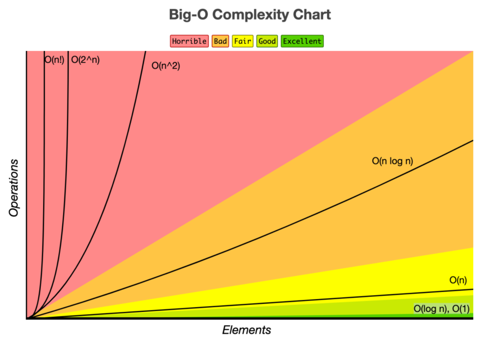

# 시간 복잡도 (Time Complexity)

- 시간 복잡도 : 알고리즘의 로직을 코드로 구현할 때, 시간 복잡도를 고려한다는 것은 ‘입력값의 변화에 따라 연산을 실행할 때, 연산 횟수에 비해 시간이 얼만큼 걸리는가’이다.
- 효율적인 알고리즘 → 입력값이 커짐에 따라 증가하는 시간의 비율을 최소화한 알고리즘 구성

아래는 1부터 n까지의 모든 자연수의 합을 구할 때 각각의 방법에 대한 알고리즘 성능을 비교하는 코드입니다.
```java
// 총 수행되는 할당 및 연산: 2 * n + 1
public static int sumUntilN1(int n) {
    // 할당 1번
    int sum = 0;
    for (int i = 1; i < n + 1; i++) {
        // 매 반복마다 덧샘 1번, 할당 1번
        sum += i;
    }
    return sum;
}

// 총 수행되는 할당 및 연산: 3
public static int sumUntilN2(int n) {
    // n + 1: 1번
    // * n: 1번
    // / 2: 1번
    return n * (n + 1) / 2;
}
```
# Big-O 표기법 (Big-O Notation)

- Big-O 표기법 : 시간 복잡도를 표기하는 방법 
- Big-O(빅-오) ⇒ 상한 점근
- Big-Ω(빅-오메가) ⇒ 하한 점근
- Big-θ(빅-세타) ⇒ 그 둘의 평균
- 위 세가지 표기법은 시간 복잡도를 최악, 최선 평균의 경우에 대하여 나타내는 방법 (오메가와 세타에 대해서 궁금하면 더 찾아보자!)

- Big-O 표기법은 ‘입력값의 변화에 따라 연산을 실행할 때, 연산 횟수에 비해 시간이 얼만큼 걸리는가?’를 표현하는 방법

- Big-O 표기법의 종류
1. O(1) : 일정한 복잡도(constant complexity)라고 하며, 입력값이 증가하더라도 시간이 늘어나지 않는다.

→ 입력값의 크기와 관계없이, 즉시 출력값을 얻어낼 수 있음
```java
public class O1Algorithm {
    public static int o1Algorithm(int[] arr, int index) {
        return arr[index];
    }

    public static void main(String[] args) {
        int[] arr = {1, 2, 3, 4, 5};
        int index = 1;
        int result = o1Algorithm(arr, index);
        System.out.println(result); // 2
    }
}
```
2. O(n) : 선형 복잡도(linear complexity)라고 부르며, 입력값이 증가함에 따라 시간 또한 같은 비율로 증가

→ 입력값이 증가함에 따라 같은 비율로 걸리는 시간이 늘어난다.

→ 입력값이 커질수록 계수의 의미가 퇴색되기에, 2배, 5배, 10배더라도 O(n)으로 표기한다.
```java
public static void oNAlgorithm(int n) {
        for (int i = 0; i < n; i++) {
            // do something for 1 second
        }
    }

    public static void anotherONAlgorithm(int n) {
        for (int i = 0; i < 2 * n; i++) {
            // do something for 1 second
        }
    }
```
3. 1. O(log n) : 로그 복잡도(logarithmic complexity)라고 부르며, Big-O표기법중 O(1) 다음으로 빠른 시간 복잡도를 가진다.

→ 로그 복잡도가 감이 잘 안잡힌다면 up&down 게임을 생각해보면 쉽게 이해할 수 있다.

 (1) 1 ~ 100중 숫자 하나를 맞춰야 되는 게임이 나왔을 때 답이 30이라고 한다면

 (2) 50, 25… 이런 식으로 계속 절반으로 줄여나가며 정답을 찾는다.

 (3) 매 기회마다 경우의 수를 절반으로 줄여나가기에 최악의 경우에도 7번이면 원하는 숫자를 찾아낼 수 있다.

 (4) 경우의 수를 절반으로 줄여나가면서 찾는 기법을 O(log n)의 시간 복잡도를 가진 알고리즘이라 한다.

 4. O(n^2) : 2차 복잡도(quadratic complexity)라고 부르며, 입력값이 증가함에 따라 시간이 n의 제곱수의 비율로 증가하는 것을 의미

→ 1이면 1초, 5이면 25초가 걸린다면 이 알고리즘의 시간 복잡도는 O(n^2)라고 표기한다.

→ O(n) 표기법과 마찬가지로 n이 커질수록 지수의 영향력이 퇴색되기에 O(n^2)라고 표기한다.
```java
public class OQuadraticAlgorithm {
    public static void oQuadraticAlgorithm(int n) {
        for (int i = 0; i < n; i++) {
            for (int j = 0; j < n; j++) {
                // do something for 1 second
            }
        }
    }

    public static void anotherOQuadraticAlgorithm(int n) {
        for (int i = 0; i < n; i++) {
            for (int j = 0; j < n; j++) {
                for (int k = 0; k < n; k++) {
                    // do something for 1 second
                }
            }
        }
    }
```

5. 1. O(2n) : 기하급수적 복잡도(exponential complexity)라고 부르며, Big-O 표기법 중 가장 느린 시간 복잡도

→ 얇은 종이를 42번 접으면 지구에서 달까지의 거리보다 커진다. (매번 접힐때 마다 2배씩 늘어나기 때문)

→ 구현한 알고리즘이 O(2^n)을 갖는다면 다른 방법을 고민해보는 것이 좋다.

```java
public class Fibonacci {
    public static int fibonacci(int n) {
        if (n <= 1) {
            return 1;
        }
        return fibonacci(n - 1) + fibonacci(n - 2);
	   }
```


