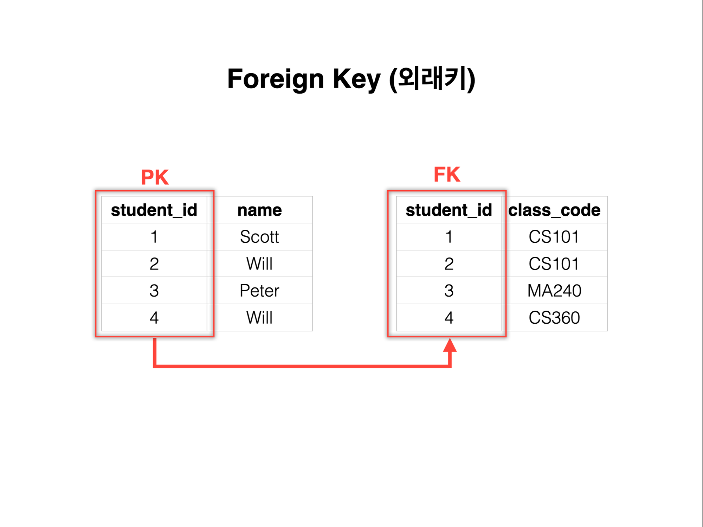
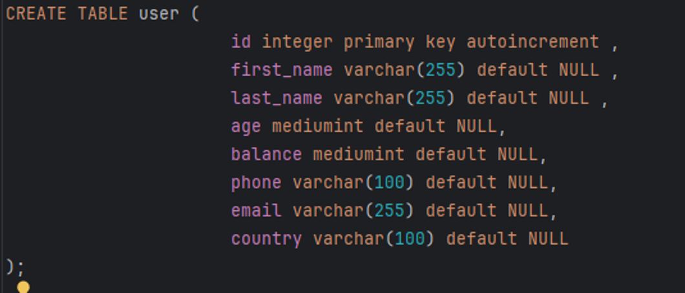
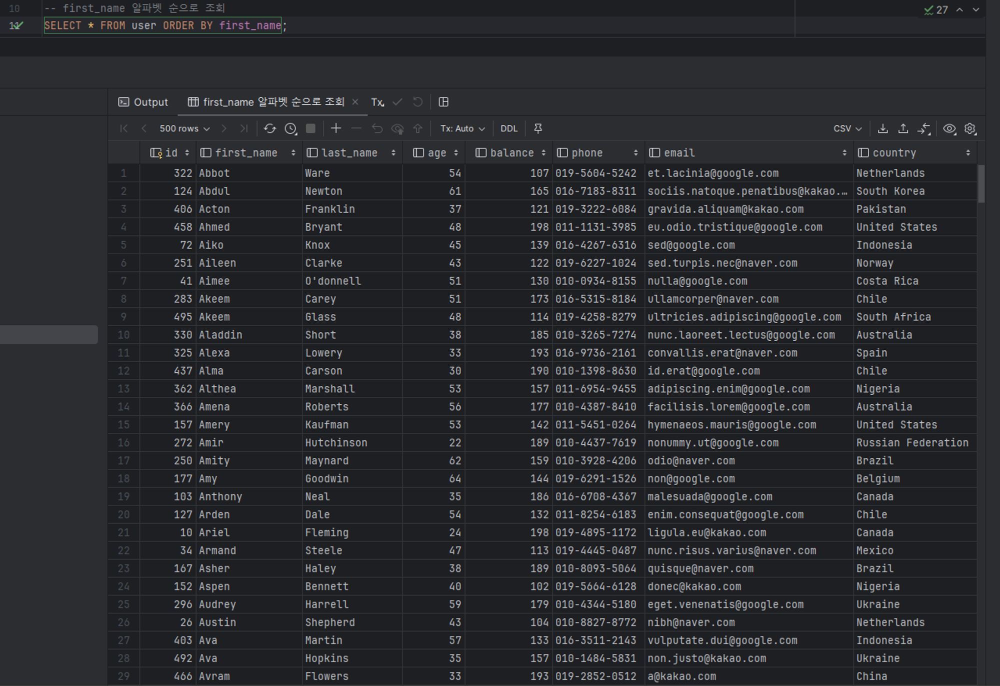
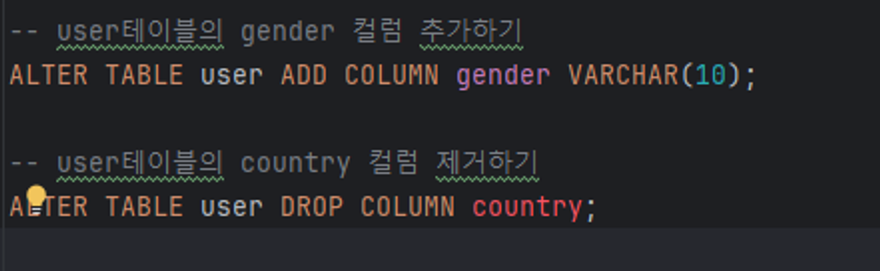
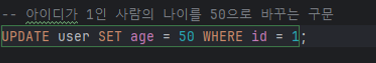
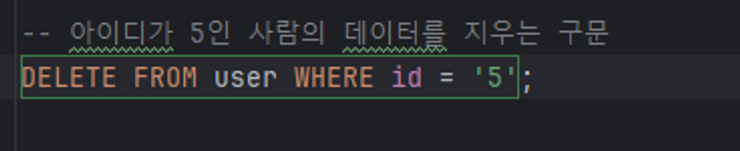

데이터 베이스란 ?
데이터베이스(DB,Database)는 일정한 규칙, 혹은 규약을 통해 구조화 되어 저장되어 있는 데이터의 모음입니다. 해당 데이터베이스를 제어, 관리하는 통합 시스템을 DBMS(DataBase Management System) 라고 하며 데이터베이스 안에 있는 데이터들은 특정 DBMS마다 정의된 쿼리 언어를 통해 삽입,삭제,수정,조회 등을 수행할 수 있습니다. 또한, 데이터베이스는 실시간 접근과 동시공유가 가능합니다.
관계형 데이터베이스의 특징
스키마
관계형 데이터베이스가 가진 데이터의 구조를 표현한 것
기본적인 데이터베이스 자료의 구조와 표현 방법 명세 2. 테이블

- 필드와 레코드를 사용해 조직된 데이터 요소들의 집합
- 필드 : 속성 또는 칼럼
- 레코드: 튜플 또는 행
  그렇게 테이블을 만들어 데이터를 삽입할 때는 각 레코드의 고유한 값인
  Primary Key(기본 키) 가 있어야한다.

주 키, 프라이머리 키, PK 등으로 불리운다. 후보키들중 메인으로 선정되는 키로 후보키의 성질을 갖는다.
유일성과 최소성을 가지며(후보키), 해당 레코드를 식별할때 기준이 되는 반드시 필요한 키이다.
추가로 기본키는 다음과 같은 조건을 따른다.
값의 변동이 잦은 후보키는 기본키로 부적절하다.
NULL값을 가질수 있는 속성이 포함된 후보키는 부적절하다.
후보키중 단순한 키를 기본키로 선택한다.
하나의 테이블에는 반드시 하나의 기본키만 존재한다.

다음으로 연관된 다른 테이블에서, 기본키를 참조해 외래키로 사용한다. 즉, 한 테이블의 연결되어있외래키는 다른 테이블의 기본키이다.

사실 외래키 설정을 따로 하지 않아도 데이터 조회가 가능하지만, 굳이 하는 이유는 데이터 무결성 때문이다.
무결성: 데이터가 항상 정확한 값을 유지하는 성질
위 테이블중 왼쪽 테이블에서 student_id가 변경되었는데 오른쪽 테이블의 student_id가 변경되지 않았다면 문제가 생긴다. 이런 상황을 예방하기 위해 외래키가 존재한다.
그럼 데이터 베이스 안에 자료들을 관리하기 위해선 어떻게 해야할 지 알아보자.
SQL
Structured Query Language
관계형 데이터베이스에서 데이터를 관리하기 위해 사용하는 언어
DDL – Data Definition Language, 데이터의 모습을 정의하기 위한 명령
DML – Data Manipulation Language, 데이터 조작을 위한 명령
데이터 무결성과 Constraints
Constraints
데이터 무결성을 유지하기 위해 테이블의 컬럼에 들어올 수 있는 데이터를
제한시키는 것, 또는 그 제약 조건
NOT NULL
UNIQUE
PRIMARY KEY
AUTOINCREMENT

CREATE TABLE
데이터베이스에 새 테이블을 만들 때 사용
CREATE TABLE 뒤에 테이블 이름을 명시, 이후 각 필드의 형태를 정의

SELECT
조회할 테이블을 조건에따라 검색
first_name 알파벳 순으로 조회
SELECT \* FROM user ORDER BY first_name;

SELECT ORDER BY : 순서를 지정해서 조회 (기본 오름차순, 내림차순 시 DESC 추가)

SELECT DISTINCT : 조회할 칼럼의 중복을 제거한다.

DROP TABLE
테이블을 제거 복구 불가
기본형식: DROP TABLE IF EXISTS user;

ALTER TABLE

이미 존재하는 테이블의 데이터를 수정

※ 위와 같은 구문으로 테이블의 컬럼 추가 삭제 및 테이블 및 컬럼 이름 변경 등이 가능하지만 처음에 정규화를 할 때 수정하지 않도록 철저하게 시작을 하는 것이 좋다.
INSERT
테이블에 데이터를 삽입하는 구문
기본형식: INSERT INTO table_name(column1, column2... VALUES (value1, value2 ...)
테이블 이름 다음에 나오는 열은 생략이 가능하다.
다만 생략할 경우 VALUES 뒤에 나오는 값들의 순서와 개수가 테이블에 정의된 열 순서, 개수와 동일해야한다.
또한 순서를 바꿔서 입력하는 것도 가능하며, 이 때는 입력한 순서에 맞춰 열 이름과 데이터를 적어야 한다.
특정 값만 입력하고 싶을 때는 직접 지정하면 된다.
INSERT INTO table(id, username) VALUES (2, '계란');
: 이렇게 할 경우 생략된 열에는 NULL 값이 들어가게 된다.

UPDATE
테이블의 데이터를 수정하는 구문
 

기본 형식: UPDATE table_name SET column = value WHERE (조건)

UPDATE 문은 대부분 WHERE 절이 들어가야한다.
WHERE 절이 안들어가면 모든 데이터가 UPDATE 된다. (-> 이런 경우는 많이 없다.)
WHERE 절을 안쓰는 경우 예시
UPDATE buy_table SET price=price\*1.5;
: 구매 테이블의 단가가 모두 1.5배 인상 되어서 수정하는 경우

DELETE

데이터(행)를 삭제하는 구문
기본 형식 : DELETE FROM table_name WHERE (조건)

주의: WHERE문이 생략되면 전체 데이터를 삭제한다.
따라서 WHERE절을 쓰는게 일반적이다.
